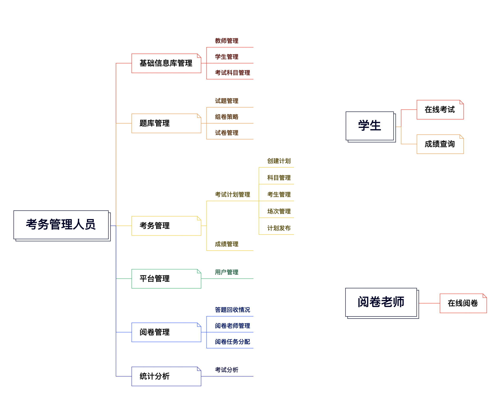
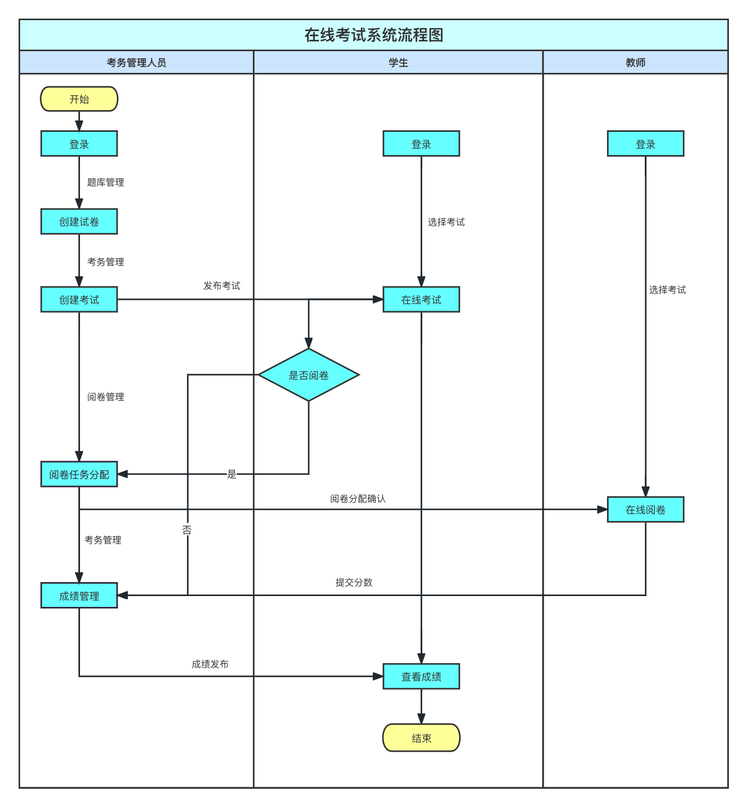
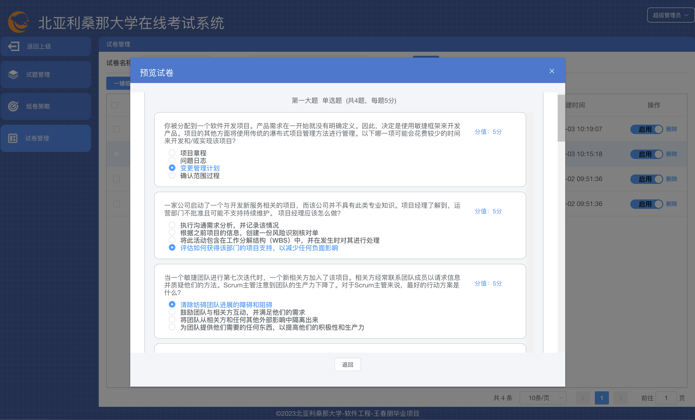
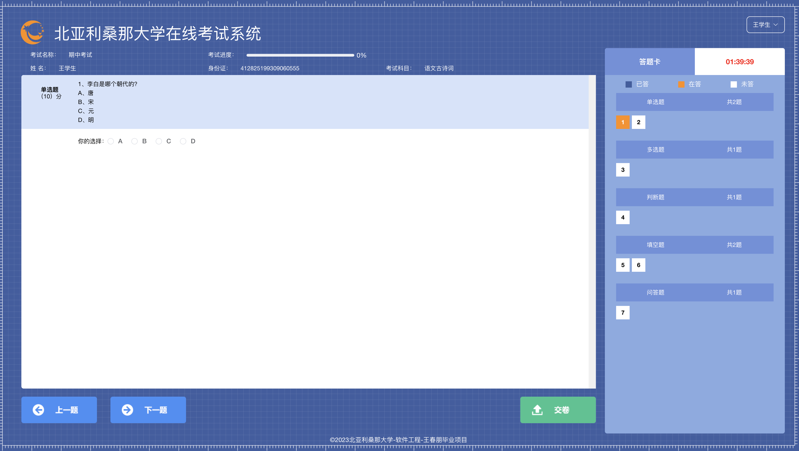
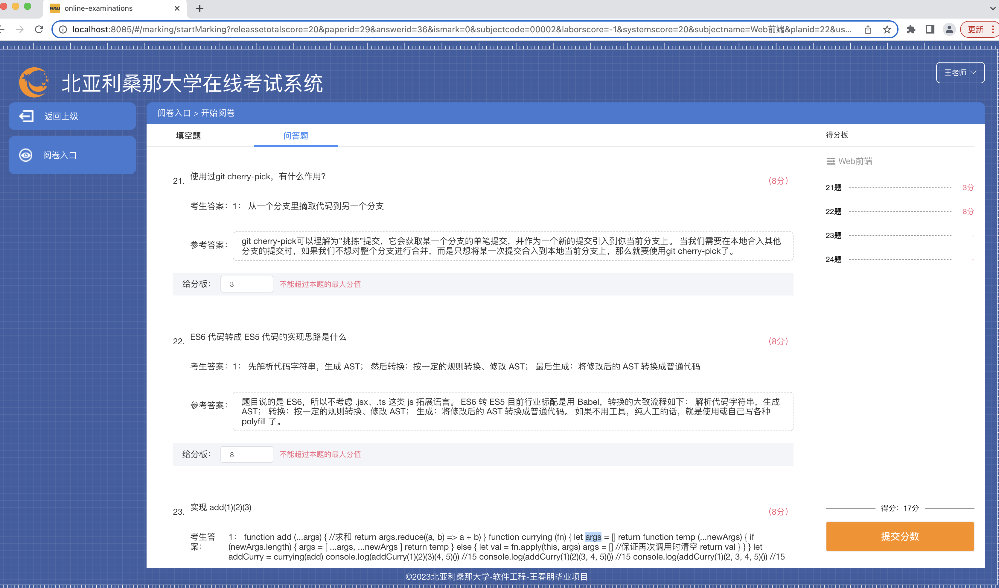
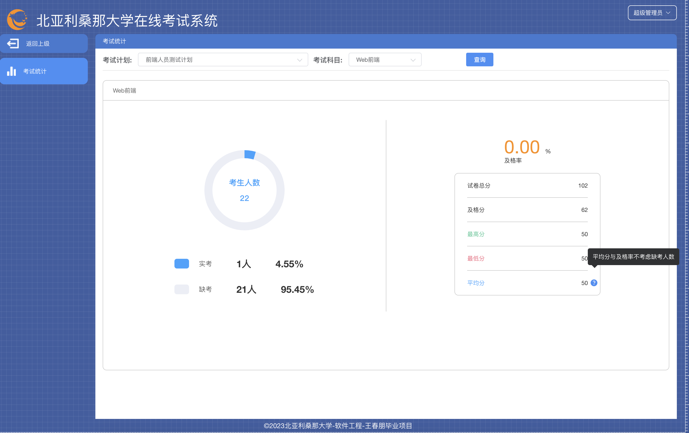

# 基于B/S架构的一种在线考试系统 (一个包含vuejs和nodejs的全栈项目)

> A Vue.js project for vue.js and node.js,related to vuex,vue-router,express4,element-ui,mysql,axios,etc .

## 项目说明

在线考试系统的用户角色有三个，分别为管理端登录、教师端登录和学生端登录。

由于本项目是全栈项目，所以在启动node服务器之前，需要安装mysql数据库，然后把server/sql/nau_exam.sql文件导入到本地的数据库中，并对server/db.js中的数据库配置项进行修改。其中nau_exam.sql里面目前存放的是一些测试数据。

项目代码文件分前端部分和服务端部分。前端部分用到了如今国内很流行的Vue技术栈，终端在根目录下执行npm run dev命令后，就可以在src目录下修改项目前端源代码，在 ```http://localhost:8085/``` 地址下可以实时看到效果。
后端部分使用node技术来实现的，终端在根目录下执行npm run server命令后,就可以在浏览器上访问 ```http://localhost:3000/``` 看到整个完整项目。其中server/dist/目录下的文件就是前端代码执行npm run build命令打包后的前端代码文件。

##用户角色功能模块图


##在线考试流程图


## 技术栈
* ### 前端技术
vue2 + vuex + vue-router + webpack + ES6/7 + axios + sass + element-ui + echarts + lodash + js-cookie
* ### 后端技术
node.js + express4 + multer + mysql-queries + mysql + node-xlsx + node-stream-zip + jsonwebtoken

## 主要实现功能
- [x] 登录（密码加密,重置,修改//token时效/不同角色登录显示不同模块功能）
- [x] 导入功能（教师/学生/科目/试题/当前考试下的考生和阅卷老师），其中学生又支持照片.zip格式文件压缩包的导入
- [x] 列表展示及分页
- [x] 各大功能模块的添加/修改/删除/多条件查询
- [x] 随机抽取试题组成试卷
- [x] 试卷展示
- [x] 创建一场完整的考试计划
- [x] 考生在线作答
- [x] 考试的统计分析
- [x] 考试成绩的发布和查看
- [x] 教师在线评分

## 目录结构介绍 ##
    |-- public                           // 静态资源文件目录
    |   |-- .favicon.ico                 // 网站logo图标
    |   |-- components                   // 入口html文件
	|-- server                           // 服务端代码目录
	|   |-- apis                         // 存放相关接口API目录
	|   |-- config                       // 存放生成token的私钥和公钥
	|   |-- dist                         // 服务端静态文件（即前端代码打包后端文件）
	|   |-- sql                          // 项目数据库sql文件
	|   |-- template                     // 存放导入模板文件
	|   |-- upload                       // 存放前端上传后的文件
	|   |-- db.js                        // 数据库连接配置文件
	|   |-- index.js                     // node server服务端入口文件
    |-- src                              // 前端源码目录
    |   |-- api                          // 存放相关后端接口目录
    |   |-- assets                       // 静态资源文件
    |   |-- components                   // 公共组件
    |   |-- directive                    // vue自定义指令目录
    |   |-- layout                       // 项目共用布局目录
    |   |-- router                       // 项目路由配置
    |   |-- store                        // 项目状态管理
    |   |-- styles                       // 存放全局样式文件
    |   |-- utils                        // 存放公用工具方法（例如axios网络请求）
    |   |-- views                        // 项目相关页面和组件
    |   |-- App.vue                      // 页面入口文件
    |   |-- main.js                      // 程序入口文件，加载各种公共组件
	|-- .browserslistrc                  // 运行环境的配置文件
	|-- .editorconfig                    // 代码编写规格
	|-- .env.development                 // 开发环境下的配置文件
	|-- .env.production                  // 生产环境下的配置文件
	|-- .eslintignore                    // eslint忽略配置文件
	|-- .eslintrc.js                     // eslint配置文件
	|-- .gitignore                       // git忽略的文件
	|-- babel.config.js                  // babel配置文件
	|-- package.json                     // 项目及工具的依赖配置文件
	|-- README.md                        // 项目说明文件
    |-- vue.config.js                    // vuecli配置文件（配置项目接口代理，打包配置等）
## 涉及一些页面效果展示

### 图1登录


### 图2首页


### 图3预览试卷


### 图4学生在线答题


### 图5教师在线评分


### 图6考试统计



## 项目运行

``` bash
# 安装依赖
npm install   

# 启动vue前端项目(http://localhost:8085/...)
npm run dev

# 启动node后端项目(http://localhost:3000/...)
npm run server

# 前端vue项目编译打包到服务端
npm run build

# 代码格式化和修复
npm run lint
